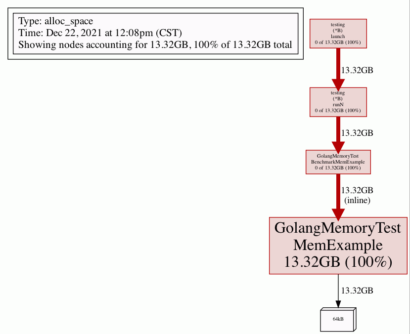

### Golang Test Memory Usage

`记录golang单元测试中，统计内存占用的工具包及使用方法`

> [How to analyze golang memory?](https://stackoverflow.com/questions/24863164/how-to-analyze-golang-memory)

#### A Memory test exemple with pprof

`tested func`

````go
func MemExample() {
	var stack [1024]byte
  // call 64kB memory
	heap := make([]byte, 64*1024)
	_, _ = stack, heap
}
`````

`test func`

```##go
func BenchmarkMemExample(b *testing.B) {
	b.ReportAllocs()
	b.ResetTimer()
	for i := 0; i < b.N; i++ {
		MemExample()
	}
	//b.StopTimer()
}
```

##### ReportAllocs

> https://pkg.go.dev/testing#B.ReportAllocs

ReportAllocs **enables malloc statistics** for this benchmark. It is equivalent to setting -test.benchmem, but it only affects the benchmark function that calls ReportAllocs.

##### ResetTimer

> https://pkg.go.dev/testing#B.ResetTimer

ResetTimer **zeroes the elapsed benchmark time** and **memory allocation counters** and **deletes user-reported metrics**. It does not affect whether the timer is running.

`test shell command`

go test

```shell
go test -bench=. -benchmem -memprofile memprofile.out
```

pprof

```shell
go tool pprof memprofile.out
```

generate gif and quit

```shell
Type: alloc_space
Time: Dec 22, 2021 at 12:08pm (CST)
Entering interactive mode (type "help" for commands, "o" for options)
(pprof) gif
Generating report in profile001.gif
(pprof) quit
```

profile001.gif


